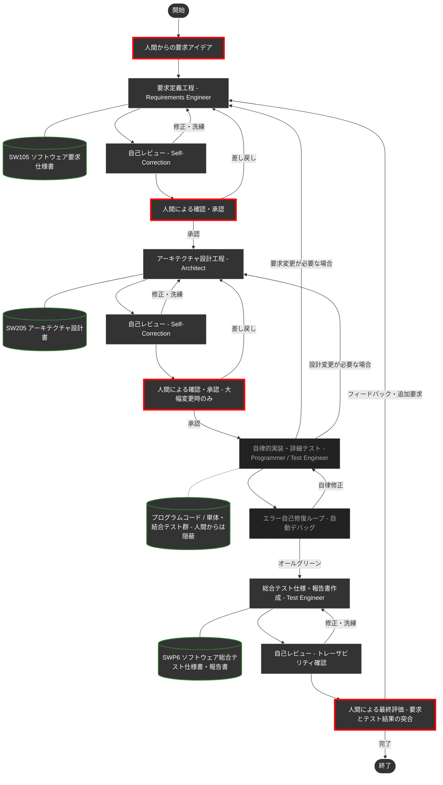

# VoiceNavi - 音声対話型ナビゲーション・デモシステム 🚗🎙️

本システム（VoiceNavi）は、「画面に依存しない、対話による安全なナビゲーション」というコンセプトを、現代の生成AI（LLM）技術を用いてブラウザ上で具現化するWebアプリケーションのデモです。
さらに本プロジェクトは、**DADA (Document and Agent Driven Agile) プロセス**の実証・教育用シミュレータとしての役割も担っています。

## 💥 DADAプロセスとは何か

近年、AIにプログラミングを自律的に任せる手法が広まっていますが、実際の運用では致命的な2つの弱点がありました。

1. **記憶喪失（一時メモリの揮発性）**
   会話で決めた仕様や設計は、AIの「コンテキストウィンドウ（一時メモリ）」に置かれます。開発や対話が進むと古い記憶から押し出されて消滅し、整合性のとれた中・大規模なシステム開発がすぐに破綻します。
2. **ブラックボックス化（人間からの制御不能）**
   AIの記憶を繋ぎ止めるために内部で「手順書」等を自動生成させても、それはAI自身の都合で書かれたものであり、人間（Product Owner）が意図通りに制御したりレビューしたりすることができません。

**「コードではなく、ドキュメントを唯一の情報源（Single Source of Truth）にする」**
これが **DADAプロセス** の核となる解決策です。

### 🌟 DADAプロセスの優位性

- **実装とテストの自律隠蔽カプセル化:** 複雑なプログラミング（実装）や単体・結合テストはAIエージェントの自律動作内に隠されています。人間は **「要求定義に適合した総合テスト（システムテスト）」** の確認・評価だけに集中できます。
- **Single Source of Truth (ドキュメント絶対主義):** AIはコードを書く前・直す前に、必ず「要求仕様書」や「設計書」を最新状態に更新します。仕様と実装の乖離が絶対に起きません。
- **高品質と低コストのハイブリッド自律制御:** 文書の新規作成・大幅改訂時はASDoQ品質モデルに則り高品質な成果物を生成。軽微な修正時は外部ガイドラインの再読み込みを自動スキップし、**API利用料（トークン）と処理の待ち時間を劇的に節約**します。
- **一瞬の自己校正（Self-Correction）:** 作業後、AI自身が瞬時に「専門レビュアー」へペルソナを切り替え、自ら品質をチェックして自己修復します。

---

## 🗺️ DADAプロセス フロー図

人間は「要求の合意」「アーキテクチャの大枠承認」「総合テストの評価」という**上位の意思決定**にのみフォーカスします。詳細なコード実装と単体・結合テストによるデバッグループは、AIエージェントの内部で自律的かつ自動的に処理されます。



---

## 📁 リポジトリ構成

各ディレクトリには、AIが迷いなく自律的に動作するための「知識」と「ルール」が配置されています。

| ディレクトリ | 役割 | 主要な内容 |
| :--- | :--- | :--- |
| [`.agents/`](.agents/) | **エージェントの脳** | 工程別の専門スキル (`skills/`) と標準手順書 (`workflows/DADA-Process.md`) |
| [`docs/`](docs/) | **ナレッジ・ベース** | 開発ドキュメントのテンプレート、ASDoQ品質モデル、作業ガイドライン |
| [`doc/`](doc/) | **開発成果物** | 人間が確認するドキュメント (SW105要求仕様書、SW205設計書、SWP6テスト報告書) |
| [`.cursor/`](.cursor/) | **全体制御** | Antigravityエージェントが常に守るべき絶対ルール (`project-rules.mdc` 等) |
| [`src/`](src/) | **フロントエンド実装** | Vite/Vanilla JS によるUIコンポーネント群 |
| [`server.js`](server.js) | **バックエンド (BFF)** | Node.js/Express によるAPIゲートウェイ。APIキーをサーバーサイドで秘匿管理 |

---

## 🚀 デモの起動方法

2つのターミナルを使用してシステムを起動します。事前に `.env` ファイルに有効なAPIキーを設定してください。

```bash
# ターミナル1: BFFサーバー（Gemini API / TTS APIとの通信を担当）
node server.js
# → "BFF Server is running on http://localhost:3000" と表示されれば成功

# ターミナル2: フロントエンド開発サーバー
npm run dev
# → "Local: http://localhost:5173/" と表示されれば成功
```

ブラウザで `http://localhost:5173/` を開き、「デモ開始」ボタンを押してください。

### 技術スタック

| 区分 | 技術 |
| :--- | :--- |
| フロントエンド | HTML5 / Vanilla CSS / Vanilla JavaScript (ESModules) + Vite |
| バックエンド (BFF) | Node.js / Express |
| 対話AI | Google Gemini API (`@google/generative-ai` SDK経由) |
| 音声合成 (TTS) | Google Cloud Text-to-Speech API |
| 音声認識 (STT) | Web Speech API（ブラウザ標準） |
| 地図 | Google Maps JavaScript API |

---

## 💡 AIエージェントを最大限に引き出すプロンプトのコツ

1. **ワークフローやスキルの明示的利用**:
   * プロジェクトに用意された **「スラッシュコマンド (`/`)」** を効果的に使います。
   * 例: `/DADA-Process 〇〇機能を追加したい` のようにコマンドを明示することで、AIは専用ルールに従って高い精度で動作します。

2. **「重大な変更・根本レビュー」の明示（ハイブリッド自律制御の活用）**:
   * AIは通常、トークンを節約するために自らの知識だけで高速動作します。
   * **「これは大幅改訂です」「ASDoQに基づきゼロから根本レビューをして」** と明示することで、AIはあえて重厚な基準ドキュメントをフルセット読み込み、最高品質を引き出すモードに切り替わります。

3. **「何を（What）」と「どうやって（How）」の分離**:
   * 「ファイルAの5行目をCに変えて」と指示するのではなく、「判定基準を10%から15%に上げたい。関連システムへの影響を最小にして」と **仕様目的を明確に指示** する方が、AIはアーキテクチャ全体を考慮した最適な実装（テスト修正や各種ドキュメント更新の自動波及を含む）を自律的に遂行できます。

---

## ⚙️ 開発プロセスの主要ルール

-   **コード先行禁止 (Single Source of Truth)**: 実装・テスト工程での根本的な不備発覚時や、人間の最終評価による手戻りが発生した場合は、コードだけを修正することを固く禁じます。必ず「要求仕様書（SW105）」へ立ち戻りドキュメントを最新化した上でプロセスを再始動します。
-   **詳細設計書の省略とコードの生きた仕様化**: 「詳細設計書（SW305）」の独立した作成は行いません。実装フェーズにおける `Implementation_plan.md` とソースコードへの「リッチコメント記述（ファイルヘッダ・全関数ヘッダ必須）」が詳細設計の役割を担います。

---

## 🔌 context7 (MCPサーバー) の設定について

AIエージェントが最新のライブラリのドキュメントを自律的に参照できるよう、`context7` MCPサーバーの利用を推奨します。

> 💡 **context7を使わない場合**
> `.cursor/rules/use-context7-for-docs.mdc` ファイルを削除するだけで、通常のAI開発をスタートできます。

### (1) context7 API Keyの取得
* [https://context7.com/](https://context7.com/) にサインインし、`More...` メニュー内の `Create API Key` からAPI Keyを取得します。

### (2) AntigravityでのMCPサーバー設定
* Antigravity画面右上の三点ドットから `MCP Servers` を選択し、`View raw config` を選択します。
* 以下のように追記し、`YOUR_API_KEY` を取得したキーに置き換えます。

```json
{
  "mcpServers": {
    "context7": {
      "command": "npx",
      "args": ["-y", "@upstash/context7-mcp", "--api-key", "YOUR_API_KEY"]
    }
  }
}
```

---

> [!NOTE]
> あなたのパートナーであるAIエージェント（ハル）は、このプロジェクトのルールとスキルを状況に応じて自律的に読み込んで動作します。技術的な矛盾やアーキテクチャの懸念があれば、AIが率直に意見・提案を行いますので、対話を通じて最高のプロダクトを作り上げましょう。

---
*Created and Maintained by マサ & ハル*