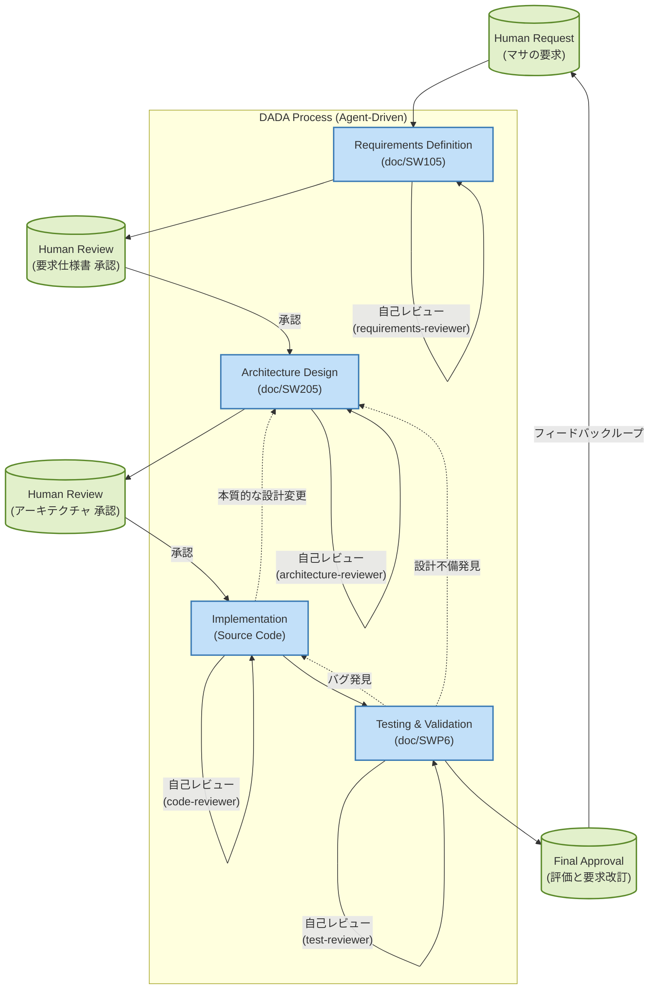

# 音声対話によるナビゲーションシステムのデモシステム

本システム（VoiceNavi）は、「画面に依存しない、対話による安全なナビゲーション」というコンセプトを、生成AI（LLM）技術を用いてブラウザ上で具現化するWebアプリケーションである。
視覚的な地図表示に頼らず、音声による対話を通じて目的地までのルート案内や周辺情報の提供を行うことを目指す。

### 技術スタック
- **フロントエンド**: HTML5 / Vanilla CSS / Vanilla JavaScript (ESModules) + Vite
- **バックエンド (BFF)**: Node.js / Express
- **対話AI**: Google Gemini 2.5 Flash（`@google/generative-ai` SDK経由）
- **音声合成 (TTS)**: Google Cloud Text-to-Speech API（Neural2）
- **音声認識 (STT)**: Web Speech API（ブラウザ標準）
- **地図**: Google Maps JavaScript API

## 特徴

このテンプレートには、開発をスムーズに進め、品質を担保するための**AI開発基盤**と**参照資料**があらかじめセットアップされています。特に、最新の「V字モデル化 DADA（Document and Agent Driven Agile）プロセス」に対応したエージェントの専門スキルが組み込まれています。

*   **Antigravity設定 (`.agents/`)**: 
    *   **ワークフロー (`workflows/`)**: DADAプロセスのV字モデル標準開発手順が定義されています。人間（マサ）の要求から始まり、AIエージェントが設計・実装・テストを自律進行します。
    *   **スキル (`skills/`)**: 各開発工程を担当する専門エージェントと、ASDoQ文書品質モデルに基づき品質を持続・保証する高次レビュアーエージェントのスキル（計8つ）が含まれます。
        *   **Implementers**: `requirements-engineer`, `architect`, `programmer`, `test-engineer`
        *   **Reviewers**: `requirements-reviewer`, `architecture-reviewer`, `code-reviewer`, `test-reviewer`
*   **ドキュメント (`docs/`)**: 
    *   ASDoQ文書品質モデルなど、開発・ドキュメント作成時に参照すべき資料が配置されています。
*   **仕様書・設計書 (`doc/`)**:
    *   要求仕様書（SW105）、アーキテクチャ設計書（SW205）、およびテスト仕様書・報告書（SWP6）などの主な作成成果物はこちらのフォルダ下に保存・管理されます。
*   **Cursor ルール (`.cursor/rules/`)**:
    *   `project-rules.mdc` にて、コード先行の禁止や、人間とAIエージェントの明確な役割分担（V字モデルの実践）が定義されています。

## DADAプロセス（V字モデル）による開発フロー

本プロジェクトの最大の特徴は、AIエージェントがコードを直接出力するのではなく、堅牢なV字モデルに則りドキュメント先行で開発を進める「**DADAプロセス**」を採用している点です。


*(💡 VS Code等でMarkdownプレビューアを使用し、Mermaid図として表示してください)*

### 開発における自動化とワークフローについて

*   **DADAプロセスの暗黙的適用**: 
    開発時、「すぐにコードを書いて」と指示を出した場合でも、エージェントはコードの直接出力を拒否し、**デフォルトで（自動的に）DADAプロセスの規則に沿った開発（要求定義 → アーキテクチャ設計 → 実装 → テスト）**を行います。重厚なプロセスが必要な局面では、エージェント側から率先して `DADA-Process` を開始するかどうかを提案します。
*   **動的な要求とアーキテクチャ仕様の構築**:
    要求定義および設計フェーズでは、エージェントが固定のテンプレートに縛られず、参考ドキュメントを読み込んだ上で最適な構成のドキュメントを自律的に立案します。トークン効率化と高速化のため、各エージェントは自らの役割や原則を暗黙的に熟知している前提で動作します。ドキュメントの新規作成や大幅改訂を伴うメジャーアップデート時のみ、ガイドライン（`docs/process/dada_document_guidelines.md`）を読み込んで構造を正確に適用します。
*   **詳細設計書の省略とコードの生きた仕様化**:
    管理の手間と仕様の乖離を防ぐため、「詳細設計書」の独立した作成は行いません。実装フェーズにおける「自律的実装計画（Implementation_plan.md）」と、ソースコードへの「ファイルヘッダ・関数ヘッダ等を含むリッチコメント記述」が詳細設計の役割を担います。
*   **適格性確認テストの完全自動化と人間の評価ループ**:
    「ソフトウェア総合テスト仕様書・報告書（SWP6）」を軸に、テスト設計・実行・自己再帰によるバグ修正までをAIが完全に自動で行います。人間はすべての処理が終わった後にこの報告書を確認してプログラムを全体評価し、さらにプロセスを回すべきか決定します。ゆえに、ユーザーは純粋に「作りたい機能（要求）」をAIに伝え、最終的な「評価・改訂」を行うことに集中できます。
*   **【厳守】要求フィードバック時の更新義務 (Single Source of Truth)**:
    実装・テスト工程での根本的な不備発覚時や、人間の最終評価による手戻りが発生した場合は、コードだけを修正することを固く禁じます。必ず遅滞なく「要求仕様書（SW105）」へ立ち戻り、要求事項の追加・変更・削除を反映させてドキュメントを最新化した上でプロセスを再始動します。

## ワークスペースのセットアップと起動方法

### ワークスペースのセットアップ

1.  **ワークスペースを開く**: VS Code等のエディタでプロジェクトフォルダを開き、Antigravity（ハル）とのセッションを開始します。拡張機能として `Markdown Preview Mermaid Support` と `Japanese Language Pack` の導入を推奨します。
2.  **要求定義の開始（DADAステップ1）**: 開発したいアプリケーションの「アイデア」や「要件の概要」をAntigravityに伝えてください。（例：「音声案内のルートがループするバグを直したい」等）
3.  **プロセスの進行**: 以降はAntigravityがDADAプロセスに則り、適宜レビューを挟みながら開発をリードします。

### デモの起動方法

2つのターミナルを使用してシステムを起動します。

```bash
# ターミナル1: BFFサーバー（Gemini API / TTS APIとの通信を担当）
cd c:\Users\mail2\Develop\VoiceNavi
node server.js
# → "BFF Server is running on http://localhost:3000" と表示されれば成功

# ターミナル2: フロントエンド開発サーバー
npm run dev
# → "Local: http://localhost:5173/" と表示されれば成功
```

ブラウザで `http://localhost:5173/` を開き、マイクボタンを押して対話を開始してください。

## context7 (MCPサーバー) の設定について

このリポジトリでは、`context7` というAIがライブラリの最新仕様書を参照できるようにするMCPサーバーを利用しています。

### (1) context7 API Keyの取得
* [https://context7.com/](https://context7.com/) にサインインします。
* 上部の `More...` メニュー内にある `Create API Key` からAPI Keyを取得・コピーします。

### (2) AntigravityでのMCPサーバー設定
* Antigravity起動画面の右上のメニュー（三点ドット）から `MCP Servers` -> `View raw config` を選択し、以下を追記・保存してください。

```json
{
  "mcpServers": {
    "context7": {
      "command": "npx",
      "args": ["-y", "@upstash/context7-mcp", "--api-key", "YOUR_API_KEY"]
    }
  }
}
```

---
*Created and Maintained by Masa & Hal*