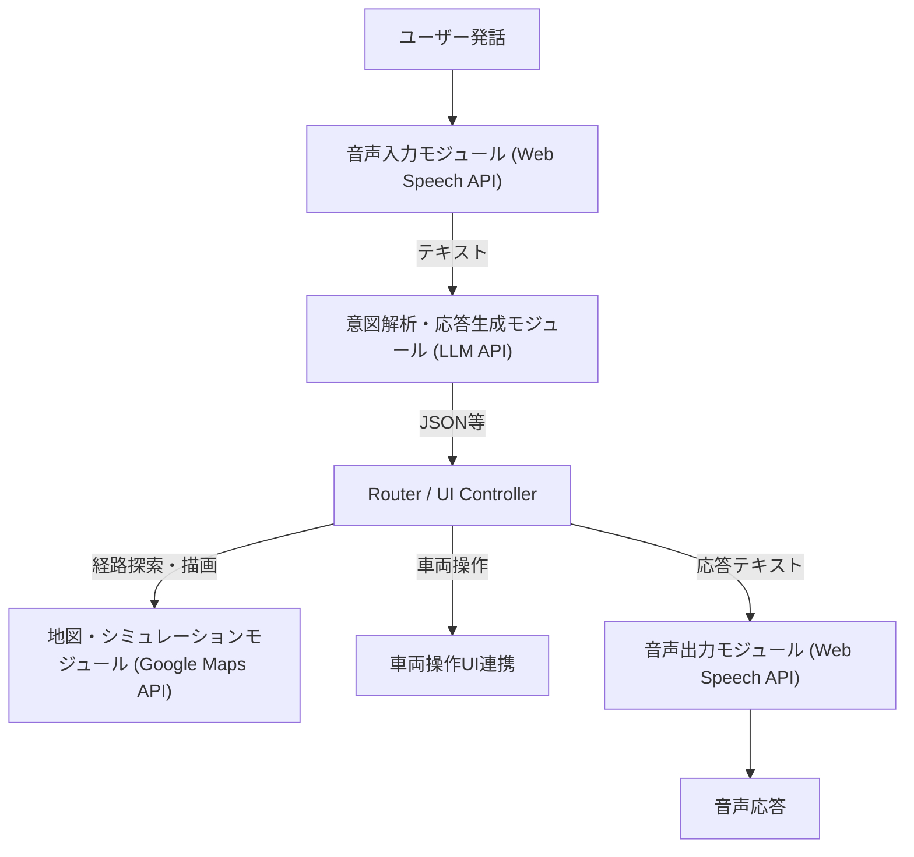
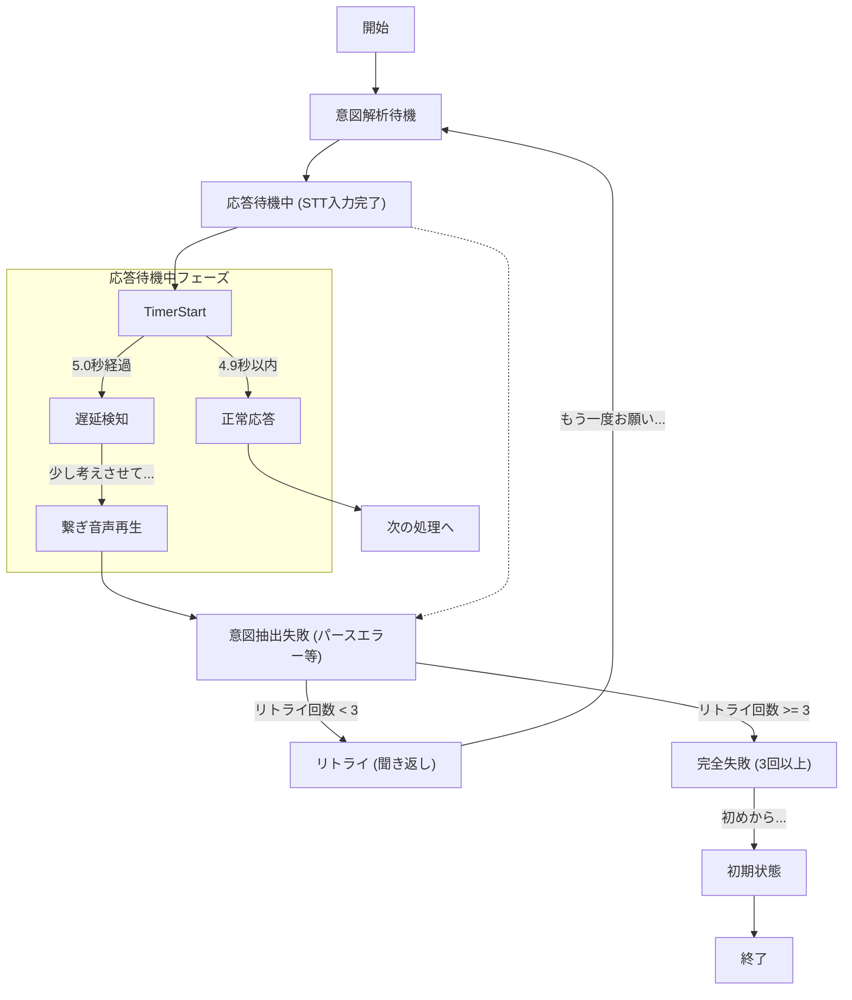
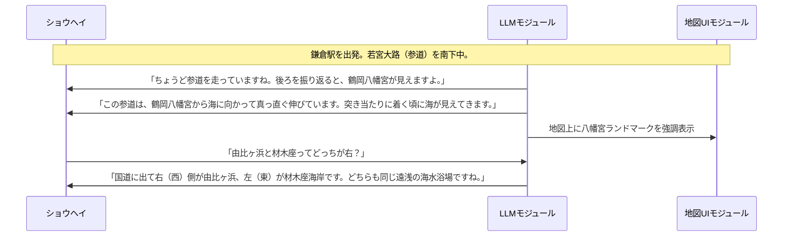
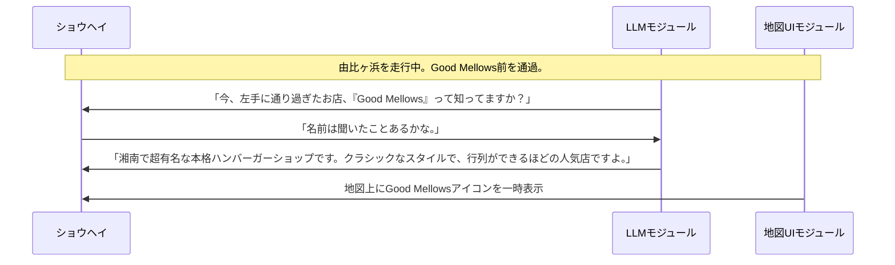
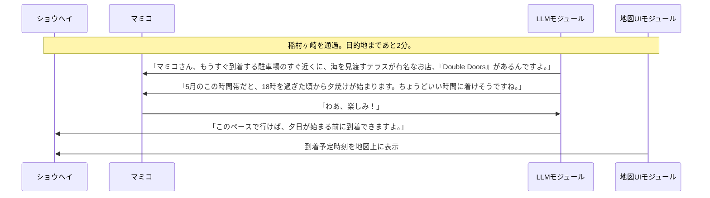
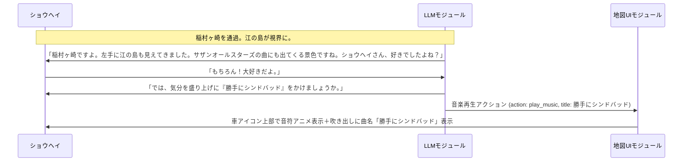
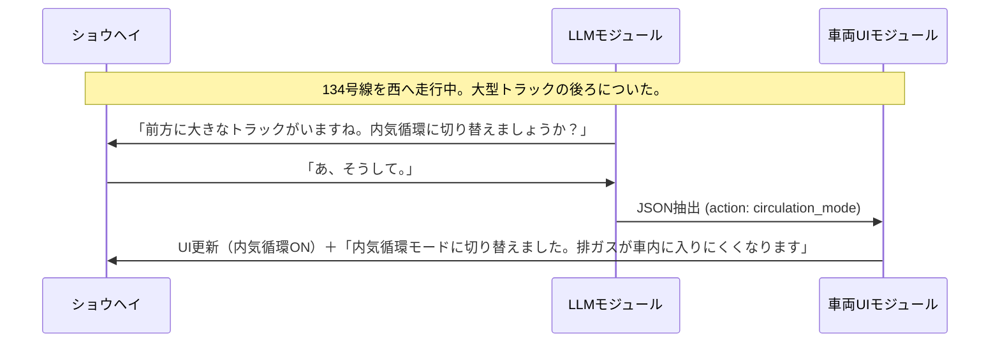

# SW105 ソフトウェア要求仕様書

## 1. システム概要
### 1.1 目的
本システム（VoiceNavi）は、1990年代に提唱された「画面に依存しない、対話による安全なナビゲーション」というコンセプトを、現代の生成AI（LLM）技術を用いてブラウザ上のデモンストレーションとして具現化するWebアプリケーションである。
視覚的情報に頼りすぎない空間把握（メンタルマップ形成）や、ドライバーごとのパーソナライズを実現し、ドライバーとAIが自然な言葉で対話する「思考するパートナー」としてのデモンストレーションを提供する。
さらに、本プロジェクトは単なるナビゲーションのデモに留まらず、AIエージェントと人間が協調して並列・自律的にソフトウェアを開発・テストする「ADA (Agent-Driven Agile) プロセス」の実証および教育用シミュレータとしての役割も担う。

### 1.2 主なユーザーと利用シーン

| ユーザー/状況 | 主な欲求 (ユースケース) | 本システムの提供価値 |
| --- | --- | --- |
| **運転中のドライバー** | 目的地検索、経由地の追加、周辺施設の検索 | 画面注視を防ぐ、声だけの柔軟なルーティング |
| **運転中のドライバー** | 車両機能の操作（エアコン、窓など） | 安全かつ直感的な擬似操作体験 |
| **運転中のドライバー** | 単調な運転時の話し相手（コンシェルジュ） | 過去の傾向を踏まえたパーソナライズされた雑談や提案 |
| **デモンストレーション操作者** | PCマイクを通じたシステムの挙動確認 | 視覚情報に頼らない「メンタルマップ形成」の体験 |

---

## 2. 機能要求

### 2.1 デモ用ナビゲーション基盤機能
1.  **地図および経路の描画**: Google Maps API等を利用し、ブラウザ上に地図とデモ用の走行経路（ポリライン）を描画できること。
    *   **【検証条件と境界値 (Acceptance Criteria & Boundary Values)】**: 画面ロード時に自動的にAPIが呼ばれ、エラー無く地図キャンバスとポリラインが描画されること。座標点データの境界値として、入力配列が空（0点）または1点のみの場合はエラーを描画せずフォールバック処理を行い、2点以上の場合は正常に経路が描画されることを確認する。
2.  **擬似走行シミュレーション**: 出発地から目的地までの経路に沿って、自車位置（マーカー）を自動的に移動させ、ドライブをシミュレーションできること。
3.  **特定のデモルートの事前設定**: 空間情報の正確な把握とデモの再現性を高めるため、事前に決定した特定のルート（「湘南海岸・鎌倉ドライブコース」を想定）を固定シナリオとしてシステムに組み込むこと。

### 2.2 自然言語対話および意図抽出機能
1.  **音声入力（STT）**: Web Speech API等を利用し、ユーザーの自然な発話をテキスト化してシステムへ入力できること。
2.  **意図解析と情報抽出**: 生成AI（LLM）を用い、入力されたテキストからユーザーの意図（ナビゲーション要求、車両操作、雑談など）を抽出し、パラメータ（「海が見える」「美味しいコーヒー」など）を構造化できること。
3.  **音声出力（TTS）**: LLMが生成した応答テキストを、Web Speech API等を利用して音声で読み上げること。

### 2.3 パーソナライズ案内とメンタルマップ形成支援機能
1.  **過去の傾向×地理条件の提案**: 「前回のように景色のいい場所」といった曖昧な要望に対し、文脈（過去の嗜好）と現在の走行環境（海沿い等）を掛け合わせ、Google Places API等の外部情報（口コミ評価など）を元に最適なスポットを提案できること。
2.  **空間的アプローチ（メンタルマップの補強）**: 単純な「数百メートル先を右」という絶対的指示ではなく、「右手に見えてくる大きな観覧車の手前」といった、ドライバーが頭の中に地図（メンタルマップ）を描きやすい相対的なランドマーク情報を含んだ案内をプロアクティブに行うこと。

### 2.4 車両の擬似操作機能（コンシェルジュ機能）
1.  **安全な車両操作の代行**: 「暑いなぁ」「交通量が多いね」などの自然な発話（さらには「花粉かな」等の状況説明）から意図を汲み取り、交通安全に影響のない操作（エアコンの温度調節、窓の開閉、換気モードの変更など）をシステムが代替実行（デモ上は実行したと発話・UI表示）すること。
2.  **雑談対応**: ナビゲーションや車両操作以外の日常的な対話（雑談）に対しても、コンシェルジュとして自然に受け答えできること。
3.  **音楽再生UIアニメーション（著作権対応）**: LLMが音楽再生アクション（`action: play_music`）を出力した場合、実際の音声データは使用せず、以下のUIアニメーションのみで「音楽が流れている」状態を表現すること。
    *   車両アイコンの上部に、♪（音符）マークがゆらゆらと動くアニメーションを表示する。
    *   車両アイコン付近の吹き出しに、曲名（例：「勝手にシンドバッド」）を表示する。
    *   **【検証条件と境界値 (Acceptance Criteria & Boundary Values)】**: `action: play_music` 受信時、UIモジュールが音声出力を行わず、車アイコン要素の♪アニメーションクラス付与と吹き出し表示のみを実行すること。再生中フラグfalse時にアニメーション停止。曲名が空またはnullの場合は吹き出しを表示せずアニメーションのみとすること。

### 2.5 ガードレール機能（お断り機能）
以下のような要求に対しては、「申し訳ありません。〇〇のため対応できません」といった安全かつ丁寧な拒否応答を行うこと。
1.  **危険行為・法令違反の要求**: 「急いでいるから赤信号を無視して」「制限速度を50km/hオーバーして」など、交通安全上危険な要求。
2.  **システム能力外の要求**: 「あそこに見える看板は何？」「今すれ違った車のナンバーは？」など、現在のシステム（カメラ・センサー等の物理的制約）では把握不可能な要求。

### 2.6 Agentic機能（自己修復・異常系対応）
AIによる自律反復（Autonomous Feedback Loop）を成立させるため、以下の異常系対応を実装すること。

1.  **LLM APIのフォールバック**: 音声からの意図抽出中、LLMのAPI応答が遅延した場合、システムは沈黙せず「少し考えさせてください」等の繋ぎの音声を再生し、バックグラウンドで自動リトライを行うこと。
    *   **【検証条件と境界値 (Acceptance Criteria & Boundary Values)】**: 応答時間の境界値として、4.9秒までは正常待機とし、5.0秒（ミリ秒単位の指定閾値）をタイムアウト（異常検知）として繋ぎ音声の発火トリガーが作動すること。
2.  **意図不明時の自己修復**: STTによる音声認識は成功したが、LLMが意図を全く抽出できなかった場合（JSONパースエラー等）、エラーで落とすのではなく「もう一度お願いできますか？」と聞き返すフェーズへ移行すること。最大リトライ回数は3回とし、3回連続で失敗した場合は安全のためシステムを初期状態に戻し「初めからやり直してください」と案内すること。
    *   **【検証条件と境界値 (Acceptance Criteria & Boundary Values)】**: ネットワーク切断やパース不可能な不正文字列（JSON構文エラーとなる文字列等）をモックで意図的に発生させた際、JavaScriptがクラッシュせず適切にフォールバック用の繋ぎ音声のトリガー関数が呼ばれ、かつリトライカウンタが3に達した時点で初期化ハンドラが発火すること。

---

## 3. 非機能要求

### 3.1 ユーザーインターフェース (UI)
*   **Webブラウザでの動作**: 一般的なPCブラウザ（Chrome, Edge等）において、特別なプラグインなしに動作すること（マイク・スピーカーの権限許可は必要）。
*   **視覚的フィードバック**: アプリケーション画面には、現在地を示す地図のほか、対話のログ（チャットUIのようなテキスト履歴）を表示し、デモの状況を視覚的にも追えるようにすること。

### 3.2 性能と制約
*   **応答速度の確保**: 発話完了から音声応答の開始まで、極端な遅延（数十秒レベル）が発生しないよう最適化すること。
*   **シナリオの逸脱防止**: LLMのシステムプロンプト等により、デモの目的から大きく逸脱した不可解な回答（ハルシネーション）を極力抑えること。

### 3.3 Agentic Architecture (AI分散開発向け疎結合モジュール)
本プロジェクトを複数のAIエージェントで並列・自律的に開発（Agentic Coding）できるよう、実装において以下のアーキテクチャ制約を厳守すること。
1.  **モジュールの完全分離**: 「音声入力(STT)/出力(TTS)モジュール」「LLM対話(意図抽出・応答生成)モジュール」「Google Maps描画・シミュレーションモジュール」をそれぞれ独立したクラスまたはファイルとして実装すること。
2.  **モックテスト可能**: 各モジュールは相互依存せず、ダミーデータ（JSONレスポンス等）を注入して独立して単体テスト可能であること。
    *   **【検証条件と境界値 (Acceptance Criteria & Boundary Values)】**: マイクを使用せずとも、テストスクリプトから任意のテキスト（String）をLLMモジュールに直接渡し、想定されるJSON構造と応答テキストが出力される自動テスト（Jest等）が実行可能であること。また、文字列長が0（空文字）の場合や、極端に長い文字列（1000文字以上など）の境界値テストにおいても、モジュールが例外でクラッシュせずに適切なエラーオブジェクトを返すこと。

---

## 4. デモ経路および対話シナリオ例

本デモシステムの振る舞いを明確にするため、以下の基本経路と対話シナリオを想定する。

### 4.0 ペルソナ設定

| 役割 | 名前 | 属性 | 備考 |
| --- | --- | --- | --- |
| **ドライバー** | ショウヘイ | 30代前半・男性 | サザンオールスターズの熱烈なファン。マミコとのデートを計画中。 |
| **助手席同乗者** | マミコ | 20代・女性 | ショウヘイのパートナー。今日のドライブを楽しんでいる。 |

*   **コンテキスト（システムへの事前付与情報）**: ショウヘイはサザンオールスターズのファンで、湘南・鎌倉エリアのドライブを好む。今日はマミコと七里ヶ浜の「Double Doors」で夕日を見ながらのデートを計画している。季節は5月。

---

### 4.1 デモ基本経路（鎌倉→七里ヶ浜コース）

| 項目 | 内容 |
| --- | --- |
| **出発地** | 鎌倉駅（神奈川県鎌倉市） |
| **経路** | 八幡宮参道（若宮大路）を南下 → 国道134号を西へ（由比ヶ浜 → 稲村ヶ崎） |
| **目的地** | 七里ヶ浜海岸駐車場（鎌倉側） |
| **距離** | 約4.87km |
| **所要時間** | 約7分（45km/h走行、信号はすべて青を想定） |

**メンタルマップ素材（LLMへの事前知識）**:
*   鎌倉駅の直ぐ北に、鶴岡八幡宮がある。このルートの参道（若宮大路）は、鶴岡八幡宮から海の方向に南へ伸びている。
*   参道の南端付近、海との境界あたりに「滑川」という川が流れる。このルートでは橋は渡らず、交差点を右折（西へ）し由比ヶ浜沿いに出る。滑川は右折直前に進行方向の左手に見える。川の左側（東）が「材木座海岸」、右側（西）が「由比ヶ浜」で、どちらも遠浅な海水浴場として有名。
*   由比ヶ浜沿いを西へ進むと「稲村ヶ崎」となる。稲村ヶ崎からは江ノ島と富士山が望め、夕日スポットとして名高い。
*   稲村ヶ崎を超えると「七里ヶ浜」。4km程度の海岸線は「日本の渚100選」に選定。サーフィン・ウィンドサーフィンのメッカであり、おしゃれなカフェやレストランが並ぶ湘南の定番デートスポット。
*   経路上に、クラシックな本格ハンバーガーで名高い「Good Mellows」がある。
*   目的地の駐車場すぐ近くに、海を望むテラスが有名な「Double Doors」がある。

---

### 4.2 想定対話シナリオ例

#### シナリオA：メンタルマップ形成（鎌倉の地理を言語で体感）

出発直後、参道を通過しながらLLMがランドマークを使った空間案内を行う。

*   **S（システム）**: 「ちょうど参道（若宮大路）を走っていますね。後ろを振り返ると、鶴岡八幡宮がまっすぐ見えますよ。この道は神社から海に向かって一直線に伸びているので、海岸に近づくにつれ、前方の視界がぱっと開けてきます。」
*   **S（システム）**: 「もうすぐ左手に滑川という小さな川が見えてきます。交差点でそのまま右折して、由比ヶ浜沿いに出ます。橋は渡りません。川の向こう（東）が材木座海岸、こちら側（西）が由比ヶ浜──どちらも夏には海水浴客でにぎわう、鎌倉を代表するビーチです。」
*   **【検証条件と境界値 (Acceptance Criteria & Boundary Values)】**: 出発地点（鎌倉駅付近）がGPS座標で一定範囲内の場合、LLMが自動的に「参道モード」のプロアクティブ案内を発話すること。GPS座標が範囲外（デモルート上でない）の場合は該当の案内をスキップし、システムが破綻しないこと。

---

#### シナリオB：ランドマーク通過案内（Good Mellows）

*   **S（システム）**: 「今、左手に通り過ぎた『Good Mellows』、湘南でとても有名な本格ハンバーガーの名店なんです。クラシックにこだわったスタイルが根強いファンを持つお店で、いつも行列が絶えないそうですよ。」
*   ※ 今回はDouble Doorsでのデートがあるため、立ち寄りは提案しない。
*   **【検証条件と境界値 (Acceptance Criteria & Boundary Values)】**: 車両位置がGood Mellows付近（座標範囲内）を通過した際に、LLMが立ち寄り提案ではなく「通過案内（情報提供のみ）」の発話を行うこと。`action` は `show_info` のみとし `navigate_to` は含まないこと。

---

#### シナリオC：Double Doorsでデートアシスト（夕日タイミング）

*   **S（システム→マミコへ）**: 「マミコさん、もうすぐ到着する駐車場のすぐ隣に、海を一望できるテラスが自慢のお店『Double Doors』があるんですよ。湘南でも特に眺めのいいスポットとして有名なんです。」
*   **S（システム→マミコへ）**: 「5月のこの時刻だと、18時を過ぎたあたりから夕焼けが空を染め始めます。このペースで走れば、ちょうどマジックアワーに間に合いそうですよ。」
*   **S（システム→ショウヘイへ）**: 「あと2分ほどです。余裕を持って到着できます。」
*   **【検証条件と境界値 (Acceptance Criteria & Boundary Values)】**: 目的地まで残り2km以内になった時点で、LLMが `to: マミコ` を指定したDouble Doors紹介の発話を出力すること。日没予測（5月、18:00基準）と現在の推定到着時刻を比較し、間に合う場合は「余裕あり」、間に合わない場合（境界値: 18:00を過ぎた到着予測）には確認を促す分岐が存在すること。

---

#### シナリオD：サザンオールスターズ＆音楽再生UIアニメーション

*   **S（システム）**: 「稲村ヶ崎です。少し先、左手に江の島が見えてきましたよ。サザンオールスターズの曲でも有名な景色ですね——ショウヘイさん、サザン好きでしたよね？」
*   **D（ショウヘイ）**: 「もちろん！大好きだよ。」
*   **S（システム）**: 「では気分を盛り上げに、『勝手にシンドバッド』をかけますね。」（車アイコン上部に♪アニメーション表示、吹き出しに「勝手にシンドバッド」表示）
*   ※ **著作権対応**: 実際の音声データは使用しない。音楽再生を表現するUIアニメーション（音符マークのアニメーション＋曲名吹き出し）で表現する。
*   **【検証条件と境界値 (Acceptance Criteria & Boundary Values)】**: `action: play_music` を受信した際、UIモジュールが音声出力を行わず、車アイコン要素に対して「♪アニメーションクラス付与」と「曲名吹き出しの表示」のみを実行すること。アニメーションは再生中フラグがtrueの間継続し、falseになった時点でアニメーションが停止すること。曲名が空文字またはnullの場合は吹き出しを表示せずアニメーションのみとすること。

---

#### シナリオE：車両操作（トラックの排ガス回避）

*   **S（システム）**: 「前方に大きなトラックがいますね。排ガスが少し気になることがあるので、エアコンを内気循環モードに切り替えましょうか？」
*   **D（ショウヘイ）**: 「あ、そうして。」
*   **S（システム）**: 「内気循環モードに切り替えました。外の排ガスが車内に入りにくくなります。」（画面上のエアコンUIを内気循環表示に切り替え）
*   **【検証条件と境界値 (Acceptance Criteria & Boundary Values)】**: LLMが読み取りコンテキスト（大型車の接近）から自律的に `action: circulation_mode` を出力し、UIモジュールが内気循環フラグをONに切り替えること。ドライバーが明示的に拒否（「大丈夫」等）した場合は操作を実行しない分岐があること。

