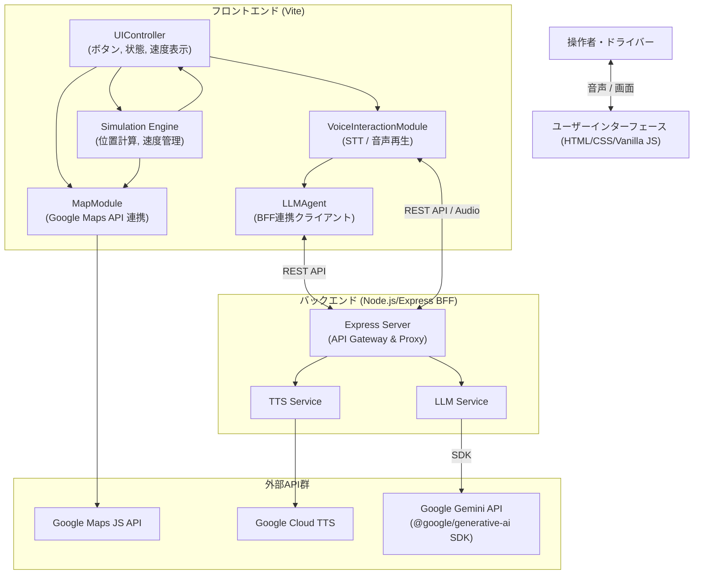

# SW205 ソフトウェアアーキテクチャ設計書

## 1. 導入

### 1.1 目的
本ドキュメントは、要求仕様（SW105）を満たすために、VoiceNaviが「どのように（How）」構築されるかの全体構造とアーキテクチャ設計を定義する。VoiceNaviは、対話による安全なナビゲーションをブラウザ上でシミュレーションするデモアプリケーションである。

### 1.2 対象範囲
本設計書は、VoiceNaviのフロントエンドモジュール構成、バックエンド（BFF）構成、外部API連携手法、Agentic Testabilityを実現するための疎結合コンポーネント設計、およびデータアーキテクチャ・非機能設計（セキュリティとフォールバック方針）を対象とする。

### 1.3 参照する要求仕様書(SRS)
- `doc/SW105_ソフトウェア要求仕様書.md`

---

## 2. システムアーキテクチャ

### 2.1 全体構成図

### 2.2 技術スタック
- **フロントエンドコア**: HTML5, Vanilla CSS, Vanilla JavaScript (ESModules)
- **フロントエンドビルドツール**: Vite
- **バックエンド (BFF)**: Node.js, Express
- **外部API**:
  - 地図描画・ルーティング: Google Maps JavaScript API
  - 対話生成 (LLM): Google Gemini API (`@google/generative-ai` SDK経由)
  - 音声合成 (TTS): Google Cloud Text-to-Speech API
  - 音声認識 (STT): Web Speech API (ブラウザ標準)

---

## 3. コンポーネント設計

各コンポーネントは役割ごとに責任を分割し、テスト時にそれぞれを独立して検証・モック化可能な完全な疎結合として実装する。

### 3.1 UIController (`src/UIController.js`)
- **役割と責任**: 各種ボタン（開始、中断、再開、終了）や画面上の情報表示（速度、テキストログ、音楽再生インジケータ等）を制御する。
  - 発話例リストクリック等の誤操作防止や状態管理を行う。
  - チャット欄へLLMの返答を描画する際、包含されているSSMLタグ類を除去（サニタイズ）する機能を持つ。
- **検証条件**: UIイベント発火時、対応する内部モジュール（`SimulationEngine` 等）のメソッドが正しく呼ばれること。文字列のサニタイズ関数がSSMLタグをすべて除去すること。

### 3.2 Simulation Engine (`src/SimulationEngine.js`)
- **役割と責任**: デモ経路に沿った自車アイコンの移動計算、速度管理、および空間コンテキストの計算を担う。
  - 基本走行は50km/h、目的地到達時は0km/h。なめりかわ交差点の指定座標通過時は10km/hとし、その前後3秒で速度を補間する。
  - 車両の「進行方向（Heading方位角）」を算出し、周囲ランドマークの「前後左右」および海（相模湾）の相対位置関係を正確に計算する。広がりを持つランドマークに対しては、複数座標との最短距離をリアルタイム算出して判定基準とする。
  - 目的地やランドマークまでの直線距離を計算し、「250m以内（視程内）」か否かのフラグを含めて情報を出力する。現在位置から未来の情報として「進行方向にある最も近い1つのランドマーク」を抽出する。
- **検証条件**: 地図API等に依存せず、座標（Lat/Lng）とTimeDeltaを入力とした純粋なロジックテストにおいて、期待通りの「現在の車速」「座標」「算出された相対位置（右/左/前/後）」を一意に出力すること。

### 3.3 MapModule (`src/MapModule.js`)
- **役割と責任**: Google Maps APIのラッパー。地図の描画、経路（ポリライン）の描画、自車マーカーの移動、指定されたランドマークの強調（点滅CSS付与）を担当する。
- **検証条件**: 指定された座標データ配列やランドマークIDを与えた際に、Google Mapsの関数（描画、クラス付与等）がエラーなく呼び出されていること。

### 3.4 VoiceInteractionModule (`src/VoiceInteractionModule.js`)
- **役割と責任**: 音声認識(STT)によるテキスト取得、およびBFFサーバーを通じた音声合成(TTS)のオーディオ再生を担当する。
- **検証条件**: 文字列（SSML含む）を入力として適切なBFF APIエンドポイント（`/api/tts`）が呼び出されること。ネットワーク切断等の例外（Catch）時に、Web Speech APIの `speechSynthesis` フォールバック関数が確実に発火すること。

### 3.5 LLMAgent (`src/LLMAgent.js`)
- **役割と責任**: BFFのチャットAPIエンドポイントに対して、ユーザーの発話テキストと `SimulationEngine` から取得したコンテキスト情報（現在位置、周囲のランドマーク）を付与したプロンプトを送信し、構造化されたJSONレスポンスを取得する。
  - **動的プロンプト生成**: `history`の件数（チャット履歴の有無）を参照し、初回の発話要求か否かを判定する。初回の場合は「必ず名前を呼ぶ」よう、2回目以降は「名前を呼ばない」よう動的な制約をシステムプロンプトに結合して送信する。
- **検証条件**: 文字列とコンテキスト情報を入力として呼び出した際、正常なJSONオブジェクト（`reply_text`, `action` 等のキーを持つ）が返却されること。BFFエラー（429等）時に、即座にリトライを停止するなど適切なエラーを上位にスローすること。

### 3.6 Backend Express Server (`server.js`)
- **役割と責任**: バックエンド(BFF)としてフロントエンドからのリクエストを受け付けるAPI Gateway。CORSのハンドリングと、安全なサーバーサイド環境でのAPIキー管理・呼び出しを行う。
- **検証条件**: モックされたリクエスト(`POST /api/chat`, `POST /api/tts`)に対し、それぞれ適切なJSONや音声バイナリデータ（Base64等）がCORSエラーなくクライアントへ返却されること。

---

## 4. データアーキテクチャ

### 4.1 データモデル
本アプリケーションはDBを持たず、ステートレスまたはオンメモリで以下の主要データモデルを取り扱う。
- **ScenarioData (経路・地点情報モデル)**:
  - 座標リスト `[{ lat, lng }, ...]`
  - ランドマーク辞書 `{ id, name, lat, lng, type }`
- **Context Model (状況モデル)**:
  - `SimulationEngine` から出力される動的データ。`{ speed, currentHeading, nearestLandmarks, isArrived, seaPosition }` 等。
- **LLM Response Model (対話モデル)**:
  - Gemini APIから取得するJSON。
  - `{ "reply_text": string, "action": Array<string>, "target_landmark_id": string }`

### 4.2 ライフサイクルと対話フロー
1. `VoiceInteractionModule` が音声入力をテキスト化(STT)、または自律発話タイマーが起動。
2. `LLMAgent` は現在時刻の `Context Model` を引数として受け取る。
3. `LLMAgent` はユーザーテキストとコンテキストからプロンプトを合成し、BFFサーバへ非同期リクエスト。
4. BFFサーバが Gemini API と通信し、結果の `LLM Response Model` をJSONでクライアントに返す。
5. フロントエンドは応答テキストを `VoiceInteractionModule` で発話(TTS)させると同時に、`target_landmark_id` や `action` に基づいて地図描画更新(`MapModule`)やUI更新(`UIController`)を行う。ステートは都度廃棄される。

---

## 5. 非機能設計

### 5.1 セキュリティ方針
- **APIキーの秘匿化**: 全てのAPIキー(Gemini API, Google Cloud TTS API等)はバックエンドサーバ上で `.env` を介して読み込まれ、クライアントサイド（ブラウザ）へは一切露出しない構成とする。

### 5.2 エラーハンドリング（フォールバック）方針
システムはユーザーに「デモの停止」や「エラーダイアログの暴露」を感じさせないよう、自律的なフィードバックループ（自己修復機能）を備える。
- **LLMの遅延・タイムアウト**: 
  - API呼び出しから5秒経過しても応答がない場合、`LLMAgent` 側で遅延イベントを発火させ、UIや音声で「考え中」のフィラーを返しつつバックグラウンドでリトライを待機する。
- **LLMのパースエラー（構造破損）**: 
  - 応答JSONのパースに失敗した場合、エラーでクラッシュさせず、最大3回までフェーズごとの聞き返し要求（もう一度お願いできますか？等）を行い処理フローを回復させる。
- **クォータ・レートリミット（429エラー）**: 
  - 429ステータスを受信した場合、無駄なリトライを直ちに打ち切り、ログ出力とともにシステムのバックオフ状態へ移行する。
- **TTS（音声合成）フォールバック**: 
  - Google Cloud TTSのサーバーダウンや通信障害発生時は、クライアント内で例外を捕捉し、自動的にブラウザ標準の `Web Speech API (SpeechSynthesisUtterance)` による音声再生に切り替え、デモの進行を継続させる。
