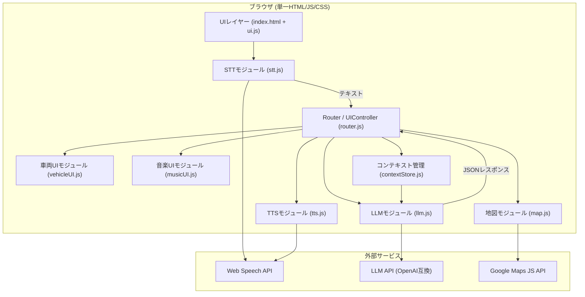
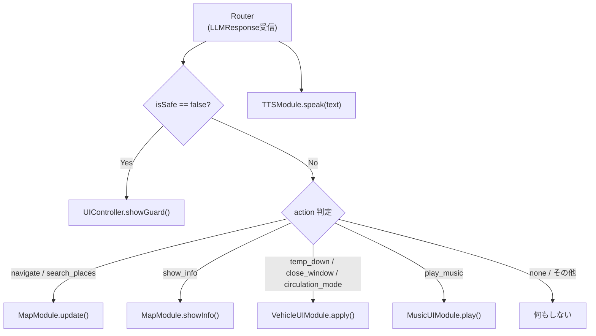

# SW205 ソフトウェアアーキテクチャ設計書

**バージョン**: 1.0  
**作成日**: 2026-03-12  
**参照要求仕様書**: [SW105 ソフトウェア要求仕様書](./SW105_ソフトウェア要求仕様書.md)

---

## 1. 導入

### 1.1 目的
本書は、SW105 ソフトウェア要求仕様書に定めた機能・非機能要件を満たすために、VoiceNavi システムを「どのような構造で実現するか（How）」を定義するアーキテクチャ設計書である。複数のAIエージェントが疎結合な状態で並列・自律的に実装・テストできることを最重要設計原則とし、`Agentic Architecture` を実現する。

### 1.2 対象範囲
- ブラウザ上で動作するシングルページWebアプリケーション（Vanilla HTML/CSS/JS）
- 外部サービス連携: Web Speech API（STT/TTS）、LLM API（OpenAI互換）、Google Maps JavaScript API

### 1.3 設計原則

| 原則 | 内容 |
| --- | --- |
| **疎結合 (Decoupling)** | 各モジュールは互いに直接参照せず、中央Routerを経由して通信する |
| **モック可能性** | 各モジュールはダミーデータ注入で単独テスト可能なインターフェースを持つ |
| **Autonomous Feedback Loop** | LLM APIの遅延・エラーに対し、自己修復（リトライ・フォールバック音声）を組み込む |
| **著作権対応** | 音楽再生はUIアニメーションのみで表現し、音源データは一切使用しない |

---

## 2. システムアーキテクチャ

### 2.1 全体構成図



### 2.2 技術スタック

| 層 | 技術 | 採用理由 |
| --- | --- | --- |
| **UI** | HTML5 / Vanilla CSS / Vanilla JS (ES Modules) | ビルドツール不要でデモとして即時実行可能 |
| **音声入力 (STT)** | Web Speech API (`SpeechRecognition`) | ブラウザ標準、プラグイン不要 |
| **音声出力 (TTS)** | Web Speech API (`SpeechSynthesis`) | ブラウザ標準、プラグイン不要 |
| **意図解析・応答生成** | LLM API（OpenAI互換 / `fetch` による HTTP呼び出し） | 実装をAPIサービスに依存させない |
| **地図** | Google Maps JavaScript API | 経路描画・PolyLine・マーカー操作に実績がある |
| **テストランナー** | Jest + jsdom | ES Modulesのモックベース単体テストに対応 |

---

## 3. コンポーネント設計

### 3.1 コンポーネント一覧と責任範囲

| ファイル | クラス/オブジェクト | 責任 |
| --- | --- | --- |
| `src/stt.js` | `STTModule` | マイク音声のテキスト化。開始/停止制御。 |
| `src/llm.js` | `LLMModule` | LLM APIへの送受信・プロンプト管理・タイムアウト制御・リトライ |
| `src/tts.js` | `TTSModule` | テキスト音声読み上げの開始/停止 |
| `src/map.js` | `MapModule` | Google Mapsの初期化・デモルート描画・マーカー移動シミュレーション |
| `src/vehicleUI.js` | `VehicleUIModule` | エアコン/窓/換気などの擬似車両UIの状態更新 |
| `src/musicUI.js` | `MusicUIModule` | 音符アニメーション・曲名吹き出しの表示/停止 |
| `src/contextStore.js` | `ContextStore` | ペルソナ情報・会話履歴・走行状態の保持 |
| `src/router.js` | `Router` | LLMのJSONレスポンスを解析し、各モジュールへ指示を振り分ける |
| `src/main.js` | - | アプリケーション初期化・各モジュールの組み立て（DI） |
| `index.html` | - | UIマークアップ・スクリプトエントリポイント |

### 3.2 コンポーネント間インターフェース

#### 3.2.1 LLMモジュール (`llm.js`)

**入力**:
```javascript
// LLMModule.send(inputText: string, context: Object): Promise<LLMResponse>
// context: { history: Array, persona: Object, locationContext: Object }
```

**出力 (`LLMResponse`)** — LLMが返却するJSONの正規スキーマ:

| フィールド | 型 | 説明 |
| --- | --- | --- |
| `action` | `string` | 実行する操作。`navigate`, `search_places`, `show_info`, `circulation_mode`, `temp_down`, `close_window`, `play_music`, `guard`, `none` のいずれか |
| `text` | `string` | TTSで読み上げる応答テキスト |
| `target` | `string?` | 発話ターゲット。`"driver"`/`"passenger"`/`"both"` のいずれか。SW105シナリオCの `to: マミコ` は `"passenger"` にマッピングする |
| `params` | `Object?` | アクション固有のパラメータ（例: `{ title: "勝手にシンドバッド" }`） |
| `isSafe` | `boolean` | `false` の場合、ガードレール発動。`action` は無視される |

**【検証条件と境界値】**: モックLLMを使用した単体テストで、空文字入力の場合は `action: "none"`, 1000文字超の場合はエラーオブジェクト（クラッシュしない）、パース不可能な応答の場合は自己修復フローに遷移することを確認。

#### 3.2.2 Routerモジュール (`router.js`)

LLMレスポンスを受け取り、`action` の値に応じて各モジュールを呼び出す。



**【検証条件と境界値】**: `action: "navigate_to"` が含まれた場合でも `MapModule` 以外は呼ばれないこと。`isSafe: false` 受信時に `VehicleUIModule` や `MusicUIModule` が実行されないことをモックで確認。

#### 3.2.3 MusicUIモジュール (`musicUI.js`)

**責任**: 著作権対応。実音声を出力せず、UIのみで音楽再生を表現する。

| メソッド | 動作 |
| --- | --- |
| `play(title: string)` | 車アイコン要素に `playing` CSSクラスを付与し♪アニメーション開始。吹き出しに曲名を表示 |
| `stop()` | `playing` クラスを除去して停止。吹き出しを非表示 |

**【検証条件と境界値】**: `title` が空文字またはnullの場合は吹き出し非表示でアニメーションのみ。`stop()` 呼び出し後に `playing` クラスが除去されることを確認。

#### 3.2.4 コンテキスト管理 (`contextStore.js`)

**責任**: 会話継続性の担保とパーソナライズの基盤。

```javascript
// ContextStore が保持する状態
{
  persona: {
    driver: { name: "ショウヘイ", preferences: ["サザンオールスターズ", "湘南ドライブ"] },
    passenger: { name: "マミコ" }
  },
  history: [ { role: "user", content: "..." }, { role: "assistant", content: "..." } ],  // 最新20ターンまで保持。超過分は先頭から削除
  location: { current: { lat, lng }, routeProgress: 0.0 },  // 0.0〜1.0
  musicPlaying: false
}
```

**【検証条件と境界値】**: 会話履歴が100件を超えた場合、古いものからトリミングされシステムがクラッシュしないこと。

---

## 4. データアーキテクチャ

### 4.1 デモルートデータ

走行経路は静的JSONとして `src/data/demoRoute.js` に埋め込む（外部API不要でテスト可能）。

```javascript
// demoRoute.js の構造
export const DEMO_ROUTE = {
  name: "鎌倉→七里ヶ浜コース",
  start: { name: "鎌倉駅", lat: 35.3197, lng: 139.5503 },
  goal:  { name: "七里ヶ浜海岸駐車場", lat: 35.3045, lng: 139.5099 },
  waypoints: [ /* 中間座標の配列 */ ],
  landmarks: [
    { name: "鶴岡八幡宮", lat: 35.3260, lng: 139.5564, triggerRadius: 300 },
    { name: "滑川交差点", lat: 35.3148, lng: 139.5540, triggerRadius: 100 },
    { name: "Good Mellows", lat: 35.3121, lng: 139.5382, triggerRadius: 150, infoOnly: true },
    { name: "稲村ヶ崎", lat: 35.3065, lng: 139.5173, triggerRadius: 200 },
    { name: "Double Doors", lat: 35.3055, lng: 139.5120, triggerRadius: 150 }
  ],
  totalDistanceKm: 4.87,
  estimatedMinutes: 7
};
```

**【検証条件と境界値】**: `waypoints` 配列が空（0点）または1点のみの場合、`MapModule` はエラーを描画せずデフォルト表示にフォールバックすること。

### 4.2 環境変数

APIキーはソースコードに直書きせず、`.env` ファイル（Gitignore済み）から読み込む。

| 変数名 | 用途 |
| --- | --- |
| `OPENAI_API_KEY` | LLM API認証 |
| `OPENAI_API_ENDPOINT` | LLM APIエンドポイント（カスタム可） |
| `GOOGLE_MAPS_API_KEY` | Google Maps JS API認証 |

---

## 5. 非機能設計

### 5.1 エラーハンドリングとフォールバック（Autonomous Feedback Loop）

| エラー種別 | 検知条件 | フォールバック動作 |
| --- | --- | --- |
| LLM APIタイムアウト | 応答が5.0秒を超過 | 繋ぎ音声「少し考えさせてください」を再生。最大3回リトライ |
| JSONパースエラー | LLM応答がJSONスキーマ不適合 | `action: "none"` として処理。リトライカウンタをインクリメント |
| 3回連続失敗 | `retryCount >= 3` | `ContextStore` をリセット。「初めからやり直してください」と案内 |
| STT認識失敗 | `onerror` イベント | エラーログのみ。UIへ「もう一度お話しください」表示 |
| Maps API失敗 | `status !== "OK"` | 地図なしで会話機能のみ継続（地図機能をグレーアウト） |

### 5.2 セキュリティ

- APIキーはサーバサイドのプロキシ経由で呼び出すことが望ましいが、デモ用途のためブラウザ側 `.env` 参照を許容する。本番利用時はバックエンドプロキシへの移行を推奨。
- LLMのシステムプロンプトにガードレール指示（危険要求の拒否）を含め、`isSafe: false` を確実に返却させる。

### 5.3 パフォーマンス

- TTS と Map の更新は非同期で並列実行し、応答遅延を最小化する。
- 会話履歴は最新10〜20ターンのみLLMに送信しトークン消費を抑制する。

---

## 6. ディレクトリ構成

```
VoiceNavi/
├── index.html            # エントリポイント（UIマークアップ）
├── src/
│   ├── main.js           # アプリ初期化・モジュール組み立て
│   ├── router.js         # LLMレスポンス解析・モジュール振り分け
│   ├── stt.js            # STTモジュール
│   ├── tts.js            # TTSモジュール
│   ├── llm.js            # LLMモジュール（API通信・リトライ）
│   ├── map.js            # 地図・シミュレーションモジュール
│   ├── vehicleUI.js      # 車両擬似操作UIモジュール
│   ├── musicUI.js        # 音楽再生UIアニメーションモジュール
│   ├── contextStore.js   # コンテキスト管理
│   └── data/
│       ├── demoRoute.js  # デモ経路データ（静的JSON）
│       └── systemPrompt.js # LLMシステムプロンプト
├── tests/
│   ├── llm.test.js
│   ├── router.test.js
│   ├── map.test.js
│   ├── vehicleUI.test.js
│   └── musicUI.test.js
├── doc/
│   ├── SW105_ソフトウェア要求仕様書.md
│   └── SW205_ソフトウェアアーキテクチャ設計書.md（本書）
├── .env                  # APIキー（Gitignore済み）
├── .env.example          # APIキーのテンプレート
└── package.json          # Jestテスト設定
```

---

## 7. 設計上の決定事項 (Architecture Decision Records)

| ADR番号 | 決定事項 | 理由 |
| --- | --- | --- |
| **ADR-01** | バンドラーなしのVanilla JS（ES Modules）を採用 | デモとして即時実行できること、ビルドツールの設定コストを省くことを優先 |
| **ADR-02** | 中央Routerパターンを採用 | 各モジュールを完全に疎結合にし、Agentic並列開発・モック単体テストを実現する |
| **ADR-03** | LLM応答のスキーマを厳格に定義（`action`, `text`, `isSafe` 等） | `test-engineer` が自動テストを生成できる明確なインターフェース契約（Agentic Testability）を担保する |
| **ADR-04** | デモルートを静的JSONとして埋め込む | Google Maps Directions APIへの依存をなくし、ネットワーク不要でテスト・デモを実行できる |
| **ADR-05** | 音楽再生はUIアニメーションのみで実装 | 著作権上の問題を完全に回避しつつ、音楽再生体験を視覚的に演出できる |
| **ADR-06** | システムプロンプトをファイルに分離（`systemPrompt.js`） | ペルソナ・ルール・コンテキストを一元管理し、テスト時にも差し替え可能にする |
