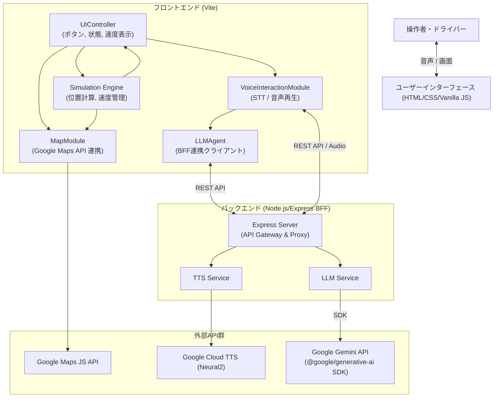

# SW205 アーキテクチャ設計書

## 1. 導入
### 1.1 目的
本ドキュメントは、再構築する VoiceNavi のアーキテクチャ設計を定義する。VoiceNaviは、対話による安全なナビゲーションをブラウザ上でシミュレーションするデモアプリケーションである。

### 1.2 対象範囲
本設計書は、VoiceNaviのフロントエンドモジュール構成、外部API連携手法、APIキーの秘匿化を含むセキュリティ方針、およびAgentic Testabilityを実現するための疎結合設計を対象とする。

### 1.3 参照ドキュメント
- `doc/SW105_ソフトウェア要求仕様書.md`

## 2. システムアーキテクチャ
### 2.1 全体構成図



### 2.2 技術スタック
- **コア**: HTML5, Vanilla CSS, Vanilla JavaScript (ESModules)
- **フロントエンドビルドツール**: Vite
- **バックエンド (BFF)**: Node.js, Express
- **外部API**:
  - 地図描画・ルーティング: Google Maps JavaScript API (フロントエンド直接通信)
  - 対話生成 (LLM): Google Gemini 2.5 Flash API (`@google/generative-ai` SDK経由、BFF経由)
  - 音声合成 (TTS): Google Cloud Text-to-Speech API (BFF経由)
  - 音声認識 (STT): Web Speech API (フロントエンド・ブラウザ標準)

## 3. コンポーネント設計
各コンポーネントは疎結合とし、テスト時にモックと差し替え可能なクラス・モジュール単位で実装する。

### 3.1 UIController (`src/UIController.js`)
- **責任**: 各種ボタン（開始、中断、再開、終了）や、画面上の情報表示（速度、テキストログ、音楽再生インジケータ等）を統括する。
  - 右側のシナリオリストからのクリックイベント発火時、確実にLLMAgent・VoiceInteractionをトリガーする。
  - 音楽再生インジケータ（曲名と音符記号）を、速度表示（時速）の左側に動的に描画・配置する。
  - チャット欄へAIの返答を描画する際、包含されているSSMLタグ類を画面表示前に除去（サニタイズ）する。
- **検証条件**: 各種ボタン押下イベントに対して、正しいイベントリスナーが発火すること。

### 3.2 Simulation Engine (`src/SimulationEngine.js`)
- **責任**: デモ経路に沿った自車アイコンの移動を計算・管理する。
  - 基本走行は 50km/h、目的地停止は 0km/h。
  - 「なめりかわ交差点」付近等、特定の指定座標に近づいた場合（手前からの減速）および通過後の再加速ロジックを独立・統合して制御し、ピンポイントで 10km/h に減速する論理演算を実装する。
  - 現在の座標から車両の「進行方向（Heading方位角：北0度とし時計回り）」を厳密に算出し、周囲のランドマークが「前後左右」のどこにあるかをバグなく判定する。
  - 対象ランドマークまでの直線距離を計算し、「250m以内か、それ以上か」の視界情報を含めてLLMAgentへ情報を提供する。
- **検証条件**: 外部への依存を持たず、座標配列と経過時間(TimeDelta)を入力とした場合、期待通りの「速度、現在座標、および進行方向（Heading）」を出力すること。

### 3.3 MapModule (`src/MapModule.js`)
- **責任**: Google Maps APIと対話する。地図の描画（オートズーム、経路ポリラインの青色描画）、自車アイコンの配置、ランドマークアイコンの一時表示・点滅制御を行う。
- **検証条件**: 指定された座標データ群を与えた場合、Google Mapsインスタンス上にマーカーとポリラインを初期化・更新できること。ランドマークIDを与えた際に点滅用CSSクラスを付与できること。

### 3.4 VoiceInteractionModule (`src/VoiceInteractionModule.js`)
- **責任**: Web Speech API(STT)による音声認識開始と結果取得、BFFのTTSエンドポイントを呼び出し、返却されたオーディオデータを再生する。
  - また、発音のぎこちなさを解消するため、SSML (Speech Synthesis Markup Language) 形式でのリクエストに対応・構築し、Google Cloud TTS APIへ渡す役割を持つ。
- **検証条件**: テキスト（またはプロンプト構成されたSSML）を入力として適切なBFF APIメソッドが呼び出されること。通信失敗時には、`speechSynthesis` へのフォールバック再生が機能すること。

### 3.5 LLMAgent (`src/LLMAgent.js`)
- **責任**: BFFのチャットAPIエンドポイントを呼び出し、ドライバーの発話（テキスト）に対するJSONレスポンスを取得する。
  - その際、Simulation Engineから得た「車両の計算済みの相対位置情報（例：前方に稲村ヶ崎、右手に由比ヶ浜など）」をコンテキストプロンプトとして動的に付与し、視覚と連動した的確なAI案内を誘導する。
- **検証条件**: 文字列および付加コンテキストを入力パラメータとして与えたとき、LLMからの正常応答JSON（空間案内に適したもの）またはエラーフォールバックが期待通りに返却されること。429エラー時は即座にリトライを停止し、クォータ消費を抑制すること。

### 3.6 Backend Express Server (`server.js` 等)
- **責任**: フロントエンドからのリクエストを中継し、Google Cloud API（Gemini, TTS）とセキュアに通信する。Gemini APIとの通信には公式SDK `@google/generative-ai` を使用する。CORS対応、APIエラーハンドリング（429ステータス転送含む）、各APIの詳細なデバッグログ監視機能を提供する。

## 4. データアーキテクチャ
- **経路データ・シナリオ**: アプリケーション内に固定のシナリオデータ（ロケーション配列、ランドマーク情報）をJSONまたはJSオブジェクトとして保持する。
- LLM応答JSON形式例:
  ```json
  {
    "reply_text": "では、勝手にシンドバッドをかけましょうか。",
    "action": "play_music",
    "target_landmark_id": "none"
  }
  ```

### 4.2 音声対話フロー
1. `VoiceInteractionModule` がユーザーの音声を認識 (STT) または `Application` がイベントを検知（目的地到着など）。
2. `LLMAgent` へテキストおよび、`SimulationEngine` から提供される空間コンテキスト（ランドマーク位置、速度、到着フラグ等）を送信。
3. `LLMAgent` が Gemini API を呼び出し、SSML形式の応答とアクション（音楽、内気循環等）を取得。
4. `VoiceInteractionModule` が応答を読み上げ (TTS)。
5. `UIController` がチャット履歴と車両ステータス（アクション反映）を更新。

## 5. 非機能設計
### 5.1 APIキー秘匿化 (セキュリティ)
- `.env` ファイルにAPIキー定義を行い、この情報を**BFF（バックエンドサーバー）のみ**で読み書きする。
- アプリケーションフロントエンドからはBFFサーバへの相対パス通信（`/api/...`等）のみを行い、本番公開時においてもフロントエンドのJSコードにAPIキーが漏洩しないアーキテクチャとする。

### 5.2 Autonomous Feedback Loop (エラーハンドリング・フォールバック)
- **LLM呼び出し遅延検知**: `LLMAgent` は呼び出し時に非同期タイマーを開始し、5秒以上応答がない場合は独自イベントを発火。「少し考えさせてください」等の音声を TTS で再生する。
- **パースエラーのリトライ**: LLMが返却した文字列が不正なJSON等の場合、`LLMAgent` はエラーを投げるのではなくリトライ回数をカウントし、「聞き返し」の応答を強制生成する（最大3回）。ただし、429（クォータ超過）エラー検出時は即座にリトライを停止し、クォータ消費を抑制する。
- **TTSフォールバック**: `VoiceInteractionModule` は、GCP TTS の fetch エラーを `catch` し、その場合は自動的に Web Speech API (ブラウザネイティブ合成) で代替再生を行う。
