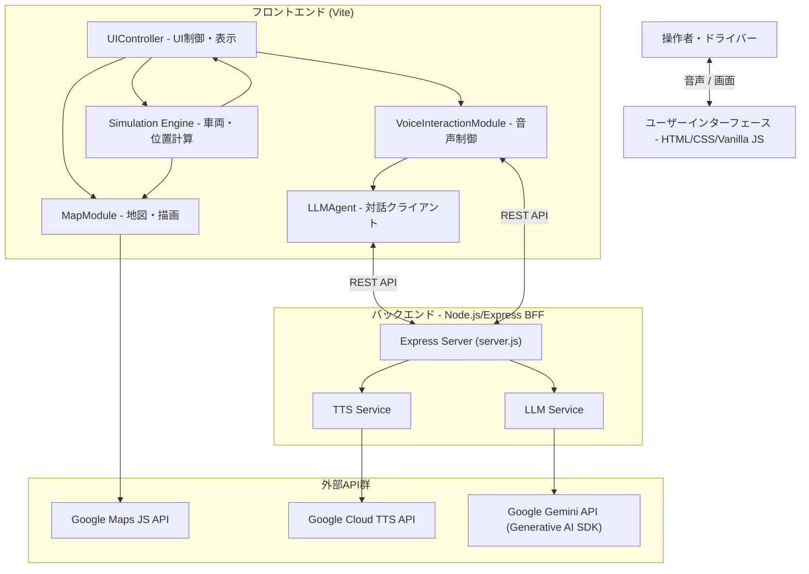

# SW205 ソフトウェアアーキテクチャ設計書

## 1. 概要

### 1.1 目的と位置づけ
本ドキュメントは、要求仕様書（SW105）に定義された要求事項を技術的に実現するための「静的構造」と「動的振る舞い」を定義する。VoiceNaviがどのように構築されるかの設計指針を明示し、実装およびテストの唯一の入力ソースとする。

### 1.2 適用範囲
本設計書は、VoiceNaviのフロントエンドモジュール構成、バックエンド（BFF）構成、外部API連携手法、Agentic Testabilityを実現するための疎結合コンポーネント設計、およびデータアーキテクチャ・非機能設計を対象とする。

### 1.3 参照ドキュメント
- [SW105 ソフトウェア要求仕様書](SW105_ソフトウェア要求仕様書.md)
- [dada_document_guidelines.md](../guidelines/dada_document_guidelines.md)

### 1.4 用語定義
- **BFF (Backend for Frontend)**: フロントエンド専用のバックエンド。APIキーの秘匿化とデータ加工を担う。
- **Agentic Testability**: AIが自律的にテスト・修正を行いやすい、疎結合で検証可能な設計。
- **SSML (Speech Synthesis Markup Language)**: 音声合成を制御するためのマークアップ言語。

---

## 2. システム構成

### 2.1 システム全体構成
VoiceNaviは、ブラウザ上で動作するフロントエンドと、Node.jsで動作するBFFサーバー、および外部のクラウドサービス（Google Cloud, Google AI Studio）で構成される。

### 2.2 主たるソフトウェア要素
- **フロントエンド**: Vite環境下でVanilla JS (ESModules) を使用。状態管理はオンメモリで保持。
- **バックエンド (BFF)**: Expressを使用。環境変数 `.env` から読み取ったAPIキーを使用し、外部APIへのプロキシとして機能する。

---

## 3. ソフトウェア構成（静的構造）

### 3.1 ソフトウェア全体構成
疎結合なモジュール構造を採用し、各モジュールが独立してテスト可能な「Agentic Architecture」とする。

### 3.2 機能ユニットの定義
各モジュールはインターフェース境界で明確な検証条件を持つ。

| ユニット名 | 役割 | インターフェース境界の検証条件 |
| :--- | :--- | :--- |
| **UIController** | ボタン操作、表示更新、SSML除去 | 入力テキストから全てのHTML/SSMLタグが除去され、プレーンテキストがUIに反映されること。 |
| **SimulationEngine** | 速度計算、位置算出、相対方位計算 | 座標と経過時間を与えた際、計算された「車速」「方位」「ランドマーク相対位置」が数学的に正しいこと。 |
| **MapModule** | 地図描画、経路描画、アイコン強調 | ランドマークIDを与えた際、対応するDOM要素に強調用CSSクラスが正しく付与されること。 |
| **VoiceInteractionModule** | 音声認識(STT)、音声再生(TTS) | TTS呼び出し失敗時、ブラウザ標準の Web Speech API に自動フォールバックすること。 |
| **LLMAgent** | 対話プロンプト生成、BFF連携 | 履歴の有無に応じ、システムプロンプトに「名前呼び」制限が正しく付与されること。 |

---

## 4. 制御方式（動的振る舞い）

### 4.1 メモリ構成とレイアウト
- **フロントエンド**: ブラウザのヒープメモリを使用。シミュレーション状態（位置、速度、履歴）は各モジュールのメンバ変数として保持する。
- **バックエンド**: ステートレス設計。リクエストごとにAPIキーを参照し、セッション情報は保持しない。

### 4.2 ソフトウェア制御方式
- **並行処理**: `async/await` を活用した非同期処理。LLM/TTSのAPI応答待ちの間も、SimulationEngineによる位置更新（`requestAnimationFrame`）を止めない。
- **状態遷移**: デモの状態（停止、走行中、中断、終了）をUIControllerが集中管理し、各モジュールに伝播させる。

### 4.3 性能見積り
- **対話応答時間**: LLM+TTSの合計で5秒以内を目指す。5秒超過時は「繋ぎ音声」を再生する。
- **描画更新周期**: 地図上の自車移動は 60fps（16.6ms）を目指す。

---

## 5. 機能ユニット詳細

### 5.1 SimulationEngine 外部I/F
- `update(deltaTime)`: 車両位置と速度の更新。
- `getContext()`: 現在の位置、方位、周辺ランドマーク情報を返す。

### 5.2 LLMAgent 外部I/F
- `getResponse(userInput, context)`: ユーザー発話と状況を送り、解析済みJSON（`reply_text`, `action`等）を取得する。

---

## 6. システムで扱うデータ

### 6.1 データ構造
- **ScenarioData**: 定数として定義される経路座標とランドマークリスト。
- **LLMResponse**: `{ reply_text: string, action: string[], target_landmark_id: string }`

---

## 7. 例外・異常処理一覧

| 異常ケース | リカバリ手順 |
| :--- | :--- |
| LLM応答遅延（>5s） | フィラー音声「少し考えさせてください」を再生し、待機を継続。 |
| TTS API 呼び出し失敗 | `Web Speech API (SpeechSynthesis)` にフォールバックして再生。 |
| JSONパースエラー | 「もう一度お願いできますか？」と聞き返し、最大3回リトライ。 |
| 地図APIロード失敗 | 警告を表示し、デモの開始を抑止する。 |

---

## 8. その他・特記事項
- **デグレード防止**: 既存の `SimulationEngine` における相対位置計算ロジック（数学的判定）は維持しつつ、最新の要求（250mルール）に適合させる。
- **コード品質**: DADAプロセスに基づき、全関数にJSDoc形式のリッチコメントを付与する。
